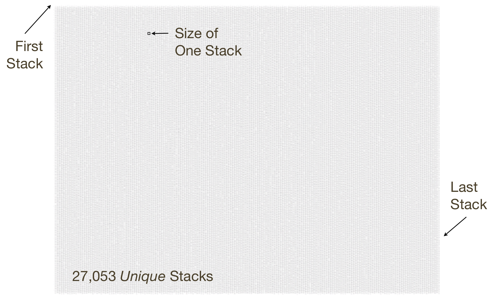
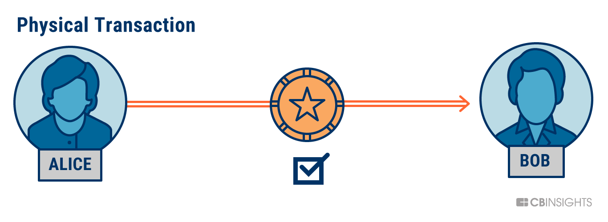
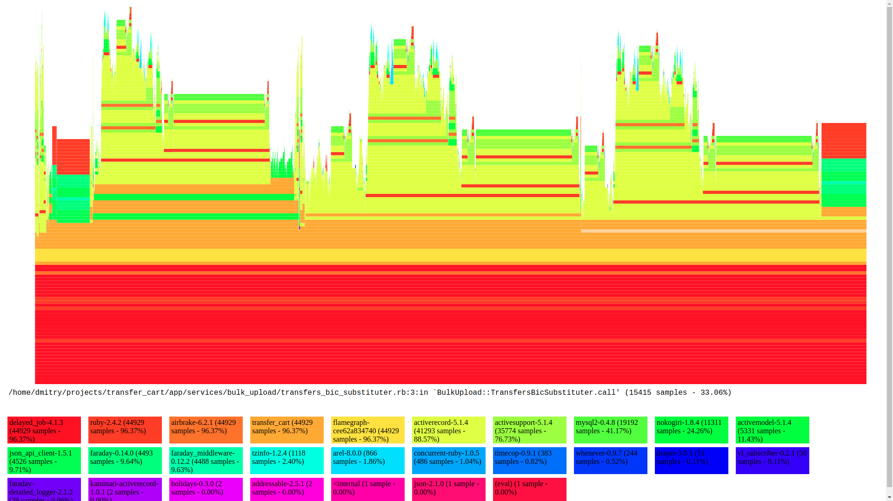
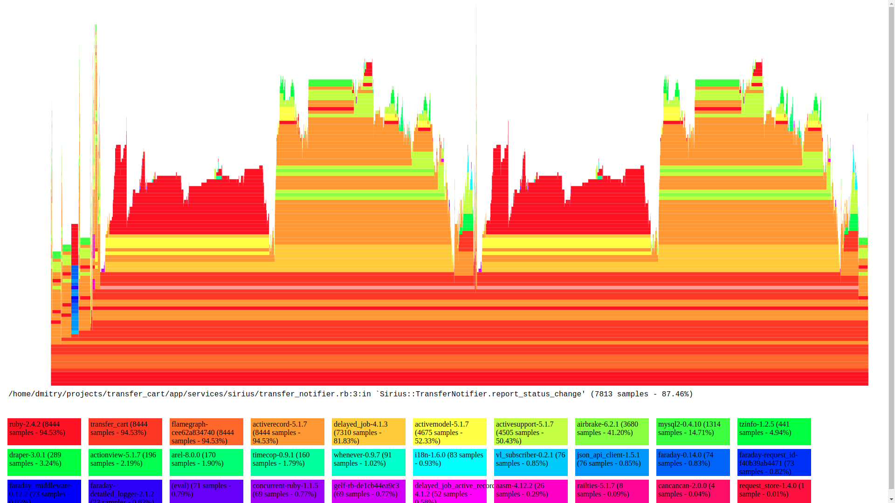
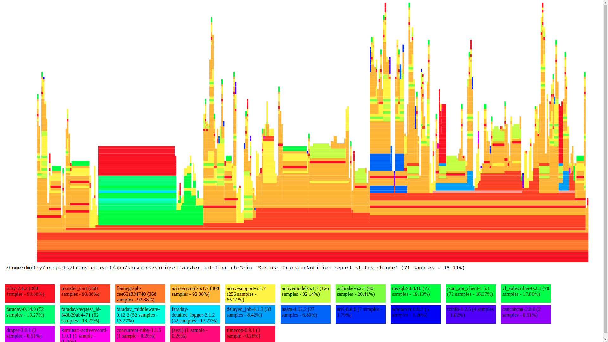

# Flamegraph: profiling with ease

## 1. About speaker

## 2. WHAT is Flamegraph?
Flamegraph is a tool to visualize application performance


## 2. So WHY Flamegraph?

### Profiling
Profiling is a form of dynamic program analysis that measures, for example, the space (memory) or time complexity of a program, the usage of particular instructions, or the frequency and duration of function calls.

### Sampling
Sampling is type of profiling, works by checking program call stack at regular intervals

###  Problem:
Something works wery slow, you sample it and ...


What's this?
Let's see..


###  Solution:
now it's much better (when you understand how to interprete it):


###  How it works:
https://www.slideshare.net/brendangregg/blazing-performance-with-flame-graphs, pages 29-36

It visualises a collection of stacktraces
- **X axis:** alphabetical sort **(!!!NOT TIME, THIS IS VERY IMPORTANT !!!)**, to maximize merging
- **Y axis:** stack depth
- **colors:** random


## QUIZ TIME!
https://www.slideshare.net/brendangregg/blazing-performance-with-flame-graphs, pages 38-48


## Time for real examples!

## Example 1 

### Context:
- Current project - banking system
 

- single transfers
 

- batch files (with up to 50.000 transfers)

first step - upload file (content is parsed, validations are performed)

### Problem
Uploading takes too long

### Flamegraph


### bad code
```ruby
transfers_bics_map = {
  1     => 'bic1',
  2     => 'bic2',
  3     => 'bic19',
  # ...
  # ...
  # ...
  49998 => 'bic3',
  49999 => 'bic1',
  50000 => 'bic20'
}

transfers_bics_map.each do |id, bic|
  BulkUpload::Transfer.find(id).update!(remote_bic: bic) # 50k requests
end
```
### fix
```ruby
transfers_bics_map = {
  'bic1' => [1, ..., 49999],
  'bic2' => [2, ...],
  'bic3' => [..., 4998],
   # ...
   # ...
   # ...
  'bic19' => [3, ...],
  'bic20' => [..., 5000],
}

transfers_bics_map.each do |bic, transfer_ids|
  BulkUpload::Transfer.where(id: transfer_ids).update_all(remote_bic: bic) # 20 requests
end
```

### result

Up to 50000x performance increase in this method

# after a couple more similar fixes:

examples/3_after/batch-upload-2018-08-10T12:07:53Z.html

## Example 2

### Context

initiated transfer — signinig —> signed transfer

### problem:
takes too long for transfer_batches with big amount of transfers

but signing only attaches 1 signature to the batch..

### Flamegraph


### bad code
```ruby
class TransferNotifier
  def self.report_status_change(transfer)
    messages = get_messages_for_transfer(transfer)
    Notifier.notify(messages)
  end
  # ...
end

class Notifier
  # ...
  def self.notify(messages)
    messages.each do |message|
      internal_notifier.delay.notify!(message) # DelayJob is invoked for each message!
    end 
  end
  # ...
end
```
### fix
```ruby
class TransferNotifier
  def self.report_status_change(transfer)
    messages = get_messages_for_transfer(transfer)
    Notifier.delay.notify(messages)  # DelayJob is invoked here now, only once!
  end
  # ...
end

class Notifier
  # ...
  def self.notify(messages)
    messages.each do |message|
      internal_notifier.notify!(message) # No DelayJob here
    end 
  end
  # ...
end
```

### result



## Conclusion
 Flamegraph is just cool :)

## Flamegraph for your language
- original implementation: https://github.com/brendangregg/FlameGraph (7600 stars)
- for ruby: https://github.com/SamSaffron/flamegraph (doesn't work LOL, but I know how to fix :) )
- for python: https://github.com/uber/pyflame (2140 stars!)
- check for your language!

## Thank you!

## Questions ?

