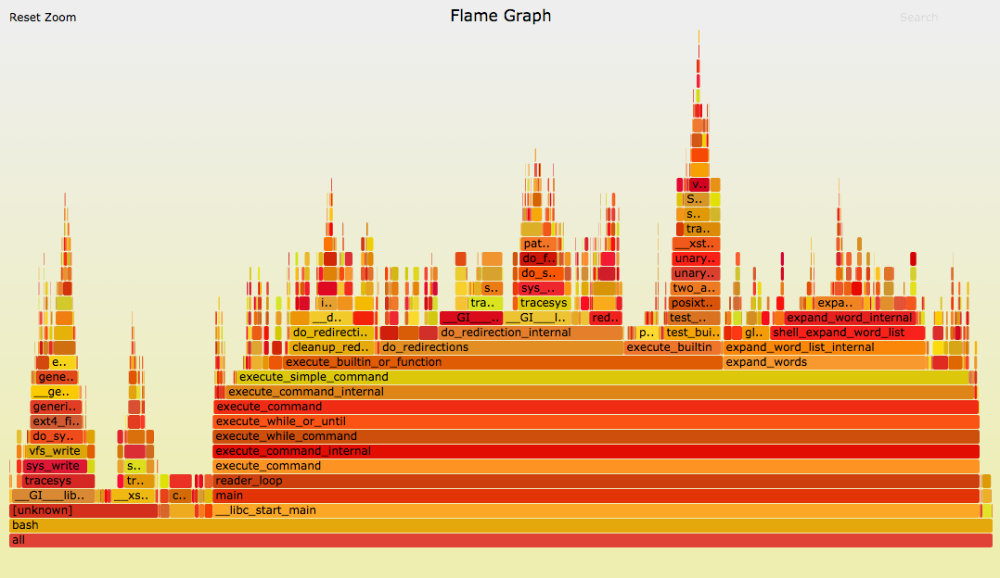
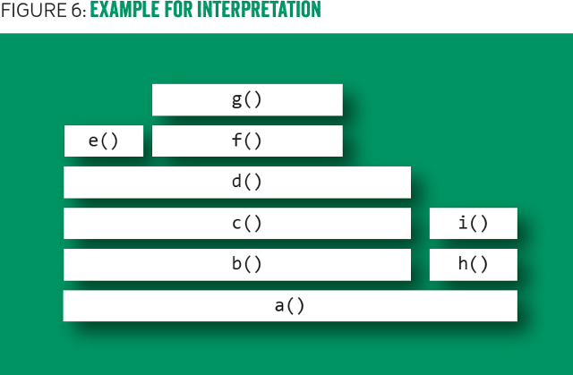

# Flamegraph: profiling with ease

## 1. About author

## 2. WHAT is Flamegraph?

## 2. So WHY Flamegraph?

####  problem:
Something works wery slow, you profile it and ...

This is a stacktrace of profiling some bash script:

####  solution:
now it's much better (when you understand how to interprete it):

####  How it works:
https://www.slideshare.net/brendangregg/blazing-performance-with-flame-graphs, pages 29-36

It visualises a collection of stacktraces
- **X axis:** alphabetical sort **(!!!NOT TIME, THIS IS VERY IMPORTANT !!!)**, to maximize merging
- **Y axis:** stack depth
- **colors:** random

## QUIZ TIME!
https://www.slideshare.net/brendangregg/blazing-performance-with-flame-graphs, pages 38-48

## Time for real, interactive (?) examples!

### Example 1 (ready)

### Example 2 (n+1 or missing index)

### Example 3 (caching)

### Conclusion

### Bonus: Funny story (depending on audience feelings)