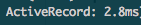

# Performance practices


**There's a specific set of practices, which will help you to eliminate most of the performance problems**

## Agenda
**Part 1: practices**
- Pagination
- Avoiding N+1
- Caching (service level, request level, Redis, conditional Get)
- Avoiding stupid logic problems
- Preliminary work (aggregating some data to DB, pre-filling cache)
- Dealing with Too long DB queries (e.g. Use index, Luke!)
-------
**Part 2: general tips**
- how to catch performance problems at the place
- when to optimize
- flamegraph

## 1. Pagination


## 2 Avoiding N+1 requests

### Problem:

```ruby
clients = Client.limit(10)
 
clients.each do |client|
  puts client.address.postcode
end
```
-> 11 requests:

```sql
SELECT * FROM clients LIMIT 10;
SELECT addresses.* FROM addresses  WHERE (addresses.client_id = 1);
SELECT addresses.* FROM addresses  WHERE (addresses.client_id = 2);
SELECT addresses.* FROM addresses  WHERE (addresses.client_id = 3);
SELECT addresses.* FROM addresses  WHERE (addresses.client_id = 4);
SELECT addresses.* FROM addresses  WHERE (addresses.client_id = 5);
SELECT addresses.* FROM addresses  WHERE (addresses.client_id = 6);
SELECT addresses.* FROM addresses  WHERE (addresses.client_id = 7);
SELECT addresses.* FROM addresses  WHERE (addresses.client_id = 8);
SELECT addresses.* FROM addresses  WHERE (addresses.client_id = 9);
SELECT addresses.* FROM addresses  WHERE (addresses.client_id = 10);
```

### It doesn't seem scary...
but with time, you end with:


```ruby
hash = {}
BulkUpload::File.all.each do |f|
  hash[f.id] = f.file_content.content.length
end
```
=>


### Solution:

```ruby
clients = Client.includes(:address).limit(10)
 
clients.each do |client|
  puts client.address.postcode
end
```
-> 2 requests:
```sql
SELECT * FROM clients LIMIT 10;
SELECT addresses.* FROM addresses
  WHERE (addresses.client_id IN (1,2,3,4,5,6,7,8,9,10));
```

### Result:


(it's not all the page)

result:

---
 after fix:



### How to not forget:
For ruby : https://github.com/flyerhzm/bullet

configuration:
```ruby
config.after_initialize do
  Bullet.enable = true
  Bullet.sentry = true
  Bullet.alert = true
  Bullet.bullet_logger = true
  Bullet.console = true
  Bullet.growl = true
  Bullet.xmpp = { :account  => 'bullets_account@jabber.org',
                  :password => 'bullets_password_for_jabber',
                  :receiver => 'your_account@jabber.org',
                  :show_online_status => true }
  Bullet.rails_logger = true
  Bullet.honeybadger = true
  Bullet.bugsnag = true
  Bullet.airbrake = true
  Bullet.rollbar = true
  Bullet.add_footer = true
  Bullet.stacktrace_includes = [ 'your_gem', 'your_middleware' ]
  Bullet.stacktrace_excludes = [ 'their_gem', 'their_middleware', ['my_file.rb', 'my_method'], ['my_file.rb', 16..20] ]
  Bullet.slack = { webhook_url: 'http://some.slack.url', channel: '#default', username: 'notifier' }
end
```


**!!!** I'm sure something similar is already implemented for your language

## 3 Caching

### 3.1 Simple caching service, memoisation

#### Problem:
```ruby
def fibonacci(n)
   n <= 1 ? n :  fibonacci( n - 1 ) + fibonacci( n - 2 ) 
end
(0..10).map {|n| fibonacci(n)} # executes almost instantly
(0..40).map {|n| fibonacci(n)} # takes 26 seconds
```
(Yes, it's slow Ruby, but it will hang on every lang with big number)

#### Solution:
```ruby
class FibonacciCaching
  attr_reader :cached_values
  def initialize
    @cached_values = { 0 => 0, 1 => 1 }
  end

  def get(n)
    return cached_values[n] if n < 2
    cached_values[n] ||= get(n-1) + get(n-2)
  end
end
```

#### results:
```ruby
require 'benchmark'

max = 40
Benchmark.bm do |x|
  x.report { (0..max).map {|n| fibonacci(n)} }
  x.report { fc = FibonacciCaching.new; (0..max).map {|n| fc.get(n)} }
  x.report { fc = FibonacciCaching.new; (0..50000).map {|n| fc.get(n)} }
end

#      user     system      total        real
# 26.400000   0.000000  26.400000 ( 26.405840)
#  0.000000   0.000000   0.000000 (  0.000052)
#  0.140000   0.020000   0.160000 (  0.166776) 
```

### 3.2 Caching something for the whole request

for ruby: https://github.com/steveklabnik/request_store


### 3.3 Redis (one love)
```ruby
class Product < ApplicationRecord
  def competing_price
    Rails.cache.fetch("#{cache_key}/competing_price", expires_in: 12.hours) do
      Competitor::API.find_price(id)
    end
  end
end

```

### 3.4 Conditional GET (HTTP `ETag` and `If-None-Match` headers)
! doesn't work together with previous example

```ruby
class ProductsController < ApplicationController
 
  def show
    @product = Product.find(params[:id])
 
    # If the request is stale according to the given timestamp and etag value
    # (i.e. it needs to be processed again) then execute this block
    if stale?(last_modified: @product.updated_at.utc, etag: @product.cache_key_with_version)
      respond_to do |wants|
        # ... normal response processing
      end
    end
    # after `stale?` call, Rails returns HTTP 304 Not Modified by default
  end
end
```

### 4 Keep in mind the whole picture (Avoiding stupid logic problems)

Example:
- service_1 process up to 50k transfers
- system should validate that any of the transfers has amount less than some limit, if not - render "At least one transfer exceeds your allowed limit"
- such validation endpoint is on service_2, accepts ONE value
-------------
how to implement?

## 5. Preliminary work
- save to database (aggregating some data)
- save to cache (pre-filling)

## 6. Dealing with Too long requests to Database (e.g. Use index, Luke!)
EXPLAIN ANALYZE - your best friend
- Understand difference between INDEX FULL SCAN / INDEX UNIQUE SCAN / TABLE SCAN etc.
- Understand what index types does your DB support (not only B-tree exist, for example indexes for geo  data (lat/long))
- Check indexes on all heavy queries fields used in `where`, `on`, `group by`

## 7. General tips

### 7.1 Amount of data
Always test with the amount of data compared to how much you'll have on prod
 - fill DB with scripts generating fake data
 - upload big files

### 7.2 Profiling and optimisation
You MUST do profiling before doing optimisation, to be sure you're not just wasting time,
Unless you're sure in advance it's 100% required in this particular place (comes with years of work experience)

profiling:
- Datadog/newRelic (good for production, costly)
- something like Flamegraph (good for local debugging, open-source - see my next presentation)